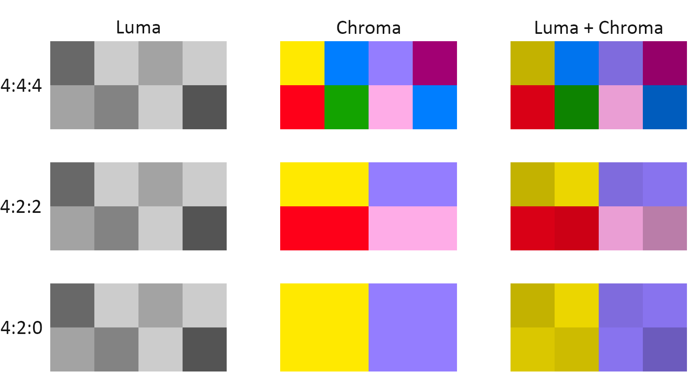

# JPEG Compression in C
Krishna Suresh and Merwan Yeditha

## Description
**Our Goal**

With this project, we wanted to implement a program in C that could take a bitmap image as an input and generate a JPEG file (more specifically JFIF)  as an output. JPEG is both a ubiquitous file format and set of typical compression techniques designed to drastically reduce the file size. Some of the steps for compression include sub-sampling the image, converting from the RGB colorspace to YCbCr, utilizing the Discrete Cosine transform to express blocks of the image as sums of cosines, and encode the data using huffman encoding. A properly working program should produce a JPEG file that looks similar to the original image while being magnitudes smaller in file size.

**Learning Goals**

With this project, we aim to grow our understanding of C, particularly using structs and malloc operations. Additionally, we wanted to gain experience with Huffman encoding, as it involved the implementation of binary trees and priority queues; these are data structures we were familiar with before the project but had not implemented in C. Finally, we wanted to gain experience using existing libraries in C by going through their documentation and practicing linking via `cmake`.

## State of the Project
We have been able to implement all of the compression and storage techniques that are typically involved in the creation of baseline JPEGs and have an output of the same dimensions as the input, but the output currently does not resemble the original image. 

### Compression Steps
**YCbCr Conversion**

The first step with JPEG compression is to convert RBG-colorspace images to YCbCr. The Y component is a grayscale copy of the original image, while Cb and Cr are two Chroma components. Chroma components are not perceived by human vision as much as grayscale information, so separating the image into these components is helpful as we can downsample and compress the chroma components.

**Chroma Downsampling**

We utilized what is known as a 4:2:2 downsample. This downsampling technique takes a 4x2 block of pixels and organizes them into four 2x1 blocks (image shown below). By downsampling the chroma we end up with less total colors to represent.




To simplify this, we just averaged each 2x1 block. Below is the code we ran on each 2x1 block inside of a nested for-loop.

```C
cb_avg = (*((cb+row*width)+col)+ *((cb+row+1*width)+col))/2;
*((cb+row*width)+col) = cb_avg;
*((cb+row+1*width)+col) = cb_avg;
cr_avg = (*((cr+row*width)+col)+ *((cr+row+1*width)+col))/2;
*((cr+row*width)+col) = cr_avg;
*((cr+row+1*width)+col) = cr_avg;
```

**Discrete Cosine Transform and Quantization**

The Discrete Cosine Transform expresses images as a weighted sum of sinusoids. When applied in two dimensions, this can be used to represent images as the weighted sum of sinusoids acting in both the x and y direction. Below is a sample of what the sinusoid components would look like.


This transform is applied to an 8x8 block in an image. Components further to the bottom-right tend to be less consequential to the image that a human can see and images tend to have smaller components of these sinusoids, so we can reduce the weight of these components. This is done through the use of quantization. We divide every number by a "quantum", stored in an 8x8 quantization table. This table is designed to reduce the weight of values further to the bottom-right. 

We implemented the DCT and quantization using GSL (GNU Scientific Library). We chose to do this because we wanted experience using existing libraries and felt that implementing matrix operations ourselves would not align with our learning goals and the end product would likely be slower than the GSL implementations. The GSL math is shown below.

```c
    gsl_matrix *inter = gsl_matrix_alloc(MAT_SIZE, MAT_SIZE);
    gsl_blas_dgemm(CblasNoTrans, CblasNoTrans, 1.0, t, m, 0.0, inter);
    gsl_blas_dgemm(CblasNoTrans, CblasTrans, 1.0, inter, t, 0.0, res)
```

**Huffman Encoding**

JPEGs then encode this transformed data using Huffman codes, which is a form of lossless encoding. Huffman encoding places values in a tree where values that show up more frequently appear closer to the head node of the tree and values that occur less frequently appear further down the tree. Values are then represented as the path it takes to get to them in binary. A '0' represents a left branch, and a '1' represents a right branch.


In this case, the encoding for D would be '11', which is only two bits. JPEGs use this to create Huffman tables. We implemented huffman encoding but were unable to create functionality to write to a JPEG, so we adapted an existing implementation for C.

**Memory Management**

Output from valgrind:
```
Write Image Data
==121786== 
==121786== HEAP SUMMARY:
==121786==     in use at exit: 0 bytes in 0 blocks
==121786==   total heap usage: 6,540,665 allocs, 6,540,665 frees, 3,905,666,269 bytes allocated
==121786== 
==121786== All heap blocks were freed -- no leaks are possible
==121786== 
==121786== Use --track-origins=yes to see where uninitialised values come from
==121786== For lists of detected and suppressed errors, rerun with: -s
==121786== ERROR SUMMARY: 10000000 errors from 3 contexts (suppressed: 0 from 0)
```

## Retrospective

Our final product exceeded our MVP but did not reach our full goal. We wanted to implement every part of the JPEG compression from top to bottom, and while we were able to implement huffman encoding on its own, we were not able to fully integrate it with our JPEG writing code in time. Therefore, we adapted an implementation of huffman coding we found online to encode data. However, we still coded the DCT, unpacked the bitmap, understood huffman coding, and JPEG file structure well enough that we were able to refactor existing code to work for us. We feel like given the effort we put in and what we were able to do, we reached our learning goals for this project.


## Resources
http://people.missouristate.edu/jrebaza/assets/10compression.pdf

https://youtube.com/playlist?list=PLpsTn9TA_Q8VMDyOPrDKmSJYt1DLgDZU4

https://github.com/dannye/jed

https://sistenix.com/rgb2ycbcr.html

https://cs.stanford.edu/people/eroberts/courses/soco/projects/data-compression/lossy/jpeg/index.htm

https://www.youtube.com/watch?v=0me3guauqOU

https://www.youtube.com/watch?v=dQw4w9WgXcQ